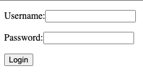
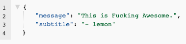
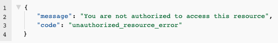

<h1 align="center">
  FOAAS CHALLANGE
  <br>
</h1>
<h4 align="center">Implemented with Kotlin, Ktor & Koin.</h4>

## Contexto

El servicio implementado se encarga de resolver a partir de un login genérico de un usuario, el acceso controlado a un endpoint ```GET /message```, en el cual el usuario logueado obtendrá un mensaje de la API de FOAAS.
Este mensaje podrá ser recuperado por el usuario respetando las siguientes restricciones:

- Consume la API y devuelve el mensaje del servicio
- Consume la API 5 veces dentro de un periodo de 10 segundos y esta devuelve los 5 mensajes del servicio
- Consume la API 6 veces dentro de un periodo de 10 segundos y el sexto llamado devuelve un error
- Consume la API 6 veces dentro de un periodo de 10 segundos, se hace un septimo llamado 10 segundos despues del primer llamado y este devuelve un mensaje del servicio

### Dependencias
* [Gradle 7](https://gradle.org/releases/)
* [Java 11](https://sdkman.io/jdks)

### Correr el proyecto

Una vez configuradas las dependencias, para levantar el proyecto es necesario ejecutar la clase App.kt o bien correr la app con gradle ejecutando ```./gradlew run```.
<br>
De la misma manera, los tests se pueden correr con gradle mediante el comando  ```./gradlew test```.

### Modo de uso

Una vez levantado el proyecto, es necesario consumir el endpoint ```GET /login``` el cual expone un formulario para ingresar un usuario y contraseña. Para este caso bastará con ingresar un usuario cuyo nombre comience con ```"lemon"``` y contenga una contraseña. 



Al ingresar el usuario y contraseña y dar click en ```Login``` el usuario será redirigido al endpoint ```/GET message``` donde obtendrá el recurso awesome del servicio de la API de FOAAS por primera vez (esta invocación NO se contabilizará como una solicitud). Este recurso podrá ser obtenido un máximo de 5 veces en un período de 10 segundos.



> Si el mensaje es solicitado 6 o más veces en un período de 10 segundos, el endpoint devolverá un error de autorización.



> Si el mensaje vuelve a solicitarse luego de 10 segundos de la primera invocación, el mensaje se retorna correctamente


### Consideraciones Generales

Client
- Se implementó un cliente abstracto de forma tal que fuera extensible para la implementación de funciones con cualquier metodo HTTP de forma transparente.
- De esta forma, la implementacion del client concreto se simplifica bastante y agregar nuevos clients seria trivial.

Limiter
- La implementación de la lógica de limiter se realizó con un manejo de sesion simple basado en la documentación de Ktor. 

Testing
- Se implementaron tests para el httpClient, handler, excepciones y rutas.

